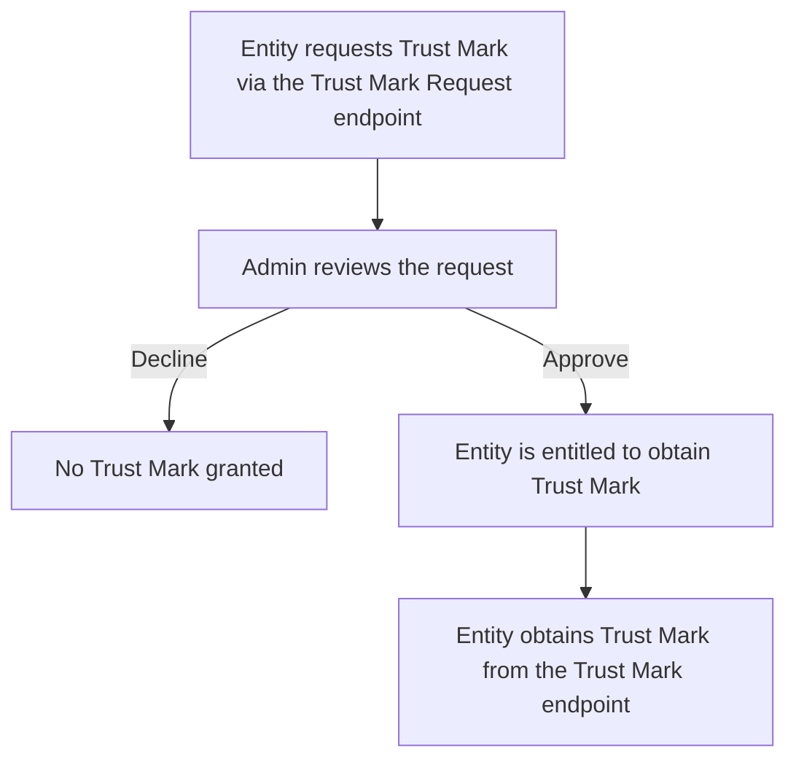
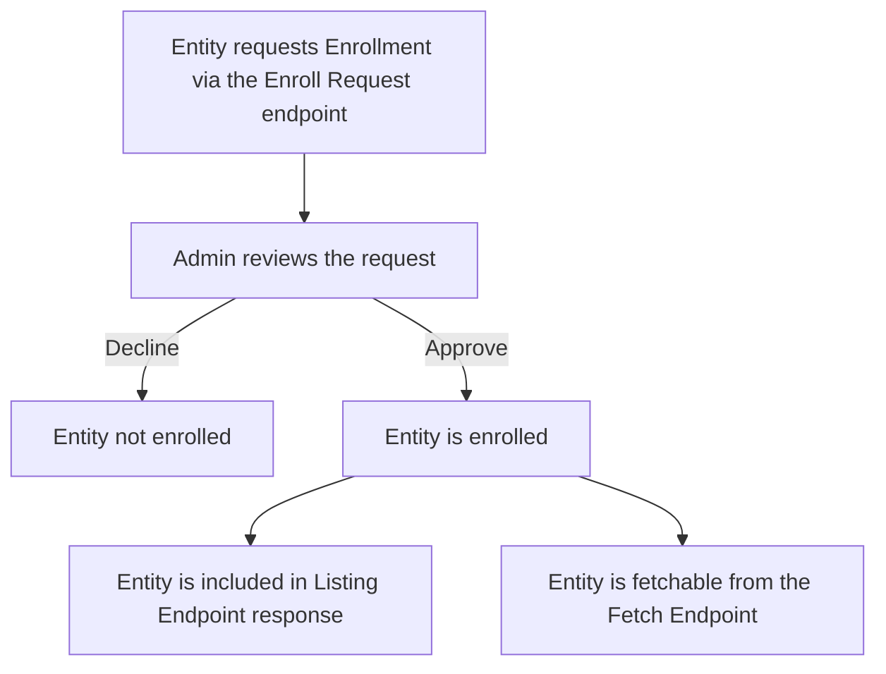

<span class="badge badge-red" title="If this option is required or optional">required, if LightHouse should do anything useful</span>

The `endpoints` config option is used to enable and configure the various endpoints that LightHouse supports. By 
enabling endpoints LightHouse functionality is extended, i.e. LightHouse can serve different roles depending on the 
enabled endpoints.

## `fetch`
Under the `fetch` option the Federation Subordinate Fetching Endpoint is configured.

This endpoint is required if LightHouse serves as a Trust Anchor and / or Intermediate Authority.

??? file "config.yaml"

    ```yaml
    endpoints:
        fetch:
            path: /fetch
            statement_lifetime: 3600
    ```

### `path`
<span class="badge badge-purple" title="Value Type">string</span>
<span class="badge badge-red" title="If this option is required or optional">required, unless `url` is given</span>

The `path` option is used to set the url path under which the Fetch Endpoint is available. Unless `url` is not set 
the full external url will be `<entity_id><path>`.

If `path` is not set, LightHouse will not provide a Fetch Endpoint. To include an external Fetch Endpoint in the 
Federation Metadata in the Entity Configuration set `url`. However, for the Fetch Endpoint it is unlikely that this 
deployment scenario makes sense.

### `url`
<span class="badge badge-purple" title="Value Type">uri</span>
<span class="badge badge-green" title="If this option is required or optional">optional</span>

The `url` option is used to set the external url of the Fetch Endpoint that is published in the Federation Metadata 
in the Entity Configuration. This option is usually not set. There are two cases where it might be set:

- To overwrite the default constructing of the external url from the provided `path`. This should usually not be needed.
- To use an external Endpoint.

### `statement_lifetime`
<span class="badge badge-purple" title="Value Type">integer</span>
<span class="badge badge-blue" title="Default Value">600000</span>
<span class="badge badge-green" title="If this option is required or optional">optional</span>

The `statement_lifetime` option sets the lifetime of the issued Entity Statements. The time is given in seconds. The 
default is a bit less than one week.

## `list`
Under the `list` option the Federation Subordinate Listing Endpoint is configured.

This endpoint is required if LightHouse serves as a Trust Anchor and / or Intermediate Authority.

??? file "config.yaml"

    ```yaml
    endpoints:
        list:
            path: /list
    ```

### `path`
<span class="badge badge-purple" title="Value Type">string</span>
<span class="badge badge-red" title="If this option is required or optional">required, unless `url` is given</span>

The `path` option is used to set the url path under which the Listing Endpoint is available. Unless `url` is not set
the full external url will be `<entity_id><path>`.

If `path` is not set, LightHouse will not provide a Listing Endpoint. To include an external Listing Endpoint in the
Federation Metadata in the Entity Configuration set `url`. However, for the Listing Endpoint it is unlikely that this
deployment scenario makes sense.

### `url`
<span class="badge badge-purple" title="Value Type">uri</span>
<span class="badge badge-green" title="If this option is required or optional">optional</span>

The `url` option is used to set the external url of the Listing Endpoint that is published in the Federation Metadata
in the Entity Configuration. This option is usually not set. There are two cases where it might be set:

- To overwrite the default constructing of the external url from the provided `path`. This should usually not be needed.
- To use an external Endpoint.

## `resolve`
Under the `resolve` option the Resolve Endpoint is configured.

This endpoint is generally optional. However, if LightHouse should serve as a Resolver it is obviously required.

??? file "config.yaml"

    ```yaml
    endpoints:
        resolve:
            path: /resolve
            grace_period: 3600
            time_elapsed_grace_factor: 0.75
    ```

### `path`
<span class="badge badge-purple" title="Value Type">string</span>
<span class="badge badge-red" title="If this option is required or optional">required, unless `url` is given</span>

The `path` option is used to set the url path under which the Resolve Endpoint is available. Unless `url` is not set
the full external url will be `<entity_id><path>`.

If `path` is not set, LightHouse will not provide a Resolve Endpoint. To include an external Resolve Endpoint in the
Federation Metadata in the Entity Configuration set `url`.

### `url`
<span class="badge badge-purple" title="Value Type">uri</span>
<span class="badge badge-green" title="If this option is required or optional">optional</span>

The `url` option is used to set the external url of the Resolve Endpoint that is published in the Federation Metadata
in the Entity Configuration. This option is usually not set. There are two cases where it might be set:

- To overwrite the default constructing of the external url from the provided `path`. This should usually not be needed.
- To use an external Endpoint.

### `grace_period`
<span class="badge badge-purple" title="Value Type">integer</span>
<span class="badge badge-blue" title="Default Value">86400</span>
<span class="badge badge-green" title="If this option is required or optional">optional</span>

The `grace_period` option sets a Grace Period for the Resolver Cache.
If a cached statement used by the resolver is not yet expired (on a request that needs it), but it will expire 
within this grace period, the cached statement still will be used, but might be refreshed in the background (see 
also the `time_elapsed_grace_factor` option). The grace period is given in seconds.

### `time_elapsed_grace_factor`
<span class="badge badge-purple" title="Value Type">float</span>
<span class="badge badge-blue" title="Default Value">0.5</span>
<span class="badge badge-green" title="If this option is required or optional">optional</span>

The `time_elapsed_grace_factor` option is used to further tweak the grace period behavior.
A cached statement that expires within the grace period will only be refreshed if a certain amount of its lifetime 
already has elapsed. How much time needs to already have elapsed is defined by this `time_elapsed_grace_factor`. 

!!! example
    
    If `grace_period` is set to `3600` statements that expire within one hour might be refreshed. If there would be 
    no `time_elapsed_grace_factor` (or it would be set to `0.0`) a statement that is only valid for an hour, would 
    always hit the grace period and would trigger a refresh even if it was only just fetched.

    With a `time_elapsed_grace_factor=0.75` LightHouse would only trigger a refresh if also 75% of the lifetime 
    (45mins in this case) have been passed.

## `trust_mark`
Under the `trust_mark` option the Federation Trust Mark Endpoint is configured.

This endpoint is required if LightHouse serves as a Trust Mark Issuer.


??? file "config.yaml"

    ```yaml
    endpoints:
        trust_mark:
            path: /trustmark
            trust_mark_specs:
                - trust_mark_type: https://tm.example.org
                  lifetime: 86400
                  ref: https://tm.example.org/ref
                  logo_uri: https://tm.example.org/logo
                  extra_claim: foobar
                  delegation_jwt: ey...
                  checker:
                      type: trust_path
                      config:
                          trust_anchors:
                              - entity_id: https://ta.example.com

    ```

### `path`
<span class="badge badge-purple" title="Value Type">string</span>
<span class="badge badge-red" title="If this option is required or optional">required, unless `url` is given</span>

The `path` option is used to set the url path under which the Trust Mark Endpoint is available. Unless `url` is not set
the full external url will be `<entity_id><path>`.

If `path` is not set, LightHouse will not provide a Trust Mark Endpoint. To include an external Trust Mark Endpoint in the
Federation Metadata in the Entity Configuration set `url`.

### `url`
<span class="badge badge-purple" title="Value Type">uri</span>
<span class="badge badge-green" title="If this option is required or optional">optional</span>

The `url` option is used to set the external url of the Trust Mark Endpoint that is published in the Federation Metadata
in the Entity Configuration. This option is usually not set. There are two cases where it might be set:

- To overwrite the default constructing of the external url from the provided `path`. This should usually not be needed.
- To use an external Endpoint.

### `trust_mark_specs`
<span class="badge badge-purple" title="Value Type">list</span>
<span class="badge badge-red" title="If this option is required or optional">required, if trust marks should be issued</span>

The `trust_mark_specs` option is used to configure which Trust Marks can be issued.
Each list element has the following configuration options defined:

#### `trust_mark_type`
<span class="badge badge-purple" title="Value Type">string</span>
<span class="badge badge-red" title="If this option is required or optional">required</span>

The `trust_mark_type` option sets the Trust Mark Type (ID) of the Trust Mark.

#### `lifetime`
<span class="badge badge-purple" title="Value Type">integer</span>
<span class="badge badge-orange" title="If this option is required or optional">required, if the Trust Mark should expire</span>

The `lifetime` option is used to set the lifetime of each Trust Mark JWT. The time is given in seconds.

#### `ref`
<span class="badge badge-purple" title="Value Type">uri</span>
<span class="badge badge-green" title="If this option is required or optional">optional</span>

The `ref` option is used to set the ref uri inside the Trust Mark JWT, as defined in the OpenID Federation 
Specification.

#### `logo_uri`
<span class="badge badge-purple" title="Value Type">uri</span>
<span class="badge badge-green" title="If this option is required or optional">optional</span>

The `logo_uri` option is used to set the logo uri inside the Trust Mark JWT, as defined in the OpenID Federation
Specification.

#### `delegation_jwt`
<span class="badge badge-purple" title="Value Type">string</span>
<span class="badge badge-orange" title="If this option is required or optional">required, if delegation is used</span>

The `delegation_jwt` option is used to set the delegation JWT inside the Trust Mark JWT, as defined in the OpenID 
Federation Specification. The delegation JWT is required if this LightHouse instance is not the Trust Mark Owner, 
but issues Trust Marks on behalf of the owner.

#### Extra Claims
Additional claims can be provided. Any provided claim that is not defined here will also be added to the Trust Mark JWT.

#### `checker`
<span class="badge badge-purple" title="Value Type">object / mapping</span>
<span class="badge badge-green" title="If this option is required or optional">optional</span>

The `checker` option is used to configure [Entity Checks](../features/entity_checks.md) that can be used to 
dynamically issue Trust Marks to Entities. Check the [Entity Checks](../features/entity_checks.md) documentation on 
the configuration format. Also see [Trust Marks](../features/trustmarks.md) for some more details on how Trust Mark 
issuance works with LightHouse.

## `trust_mark_request`
Under the `trust_mark_request` option a custom / proprietary endpoint can be configured. This endpoint allows an 
Entity to request to be entitled for a certain Trust Mark. Our implementation of the
[Trust Mark Endpoint](#trust_mark) allows [automatic checks](../features/entity_checks.md); this endpoint can be used for manual checks, 
with the following general flow:



A request to the Trust Mark Request endpoint is defined just as a request to the Trust Mark Endpoint.

This endpoint is optional and only applicable if LightHouse serves as a Trust Mark Issuer.

??? file "config.yaml"

    ```yaml
    endpoints:
        trust_mark_request:
            path: /trustmark/request
    ```

### `path`
<span class="badge badge-purple" title="Value Type">string</span>
<span class="badge badge-red" title="If this option is required or optional">required, unless `url` is given</span>

The `path` option is used to set the url path under which the Trust Mark Request Endpoint is available. Unless `url` is 
not set the full external url will be `<entity_id><path>`.

If `path` is not set, LightHouse will not provide a Trust Mark Request Endpoint. To include an external Trust Mark 
Request Endpoint in the Federation Metadata in the Entity Configuration set `url`.

### `url`
<span class="badge badge-purple" title="Value Type">uri</span>
<span class="badge badge-green" title="If this option is required or optional">optional</span>

The `url` option is used to set the external url of the Trust Mark Request Endpoint that is published in the Federation 
Metadata in the Entity Configuration. This option is usually not set. There are two cases where it might be set:

- To overwrite the default constructing of the external url from the provided `path`. This should usually not be needed.
- To use an external Endpoint.

## `trust_mark_status`
Under the `trust_mark_status` option the Federation Trust Mark Status Endpoint is configured.

This endpoint is optional and only applicable if LightHouse serves as a Trust Mark Issuer.

!!! warning ":fontawesome-solid-person-digging: NYI"

    The current implementation of the Trust Mark Status Endpoint is not yet updated to draft 43 - and therefore 
    works complelty differently.

??? file "config.yaml"

    ```yaml
    endpoints:
        trust_mark_status:
            path: /trustmark/status
    ```

### `path`
<span class="badge badge-purple" title="Value Type">string</span>
<span class="badge badge-red" title="If this option is required or optional">required, unless `url` is given</span>

The `path` option is used to set the url path under which the Trust Mark Status Endpoint is available. Unless `url` is
not set the full external url will be `<entity_id><path>`.

If `path` is not set, LightHouse will not provide a Trust Mark Status Endpoint. To include an external Trust Mark
Status Endpoint in the Federation Metadata in the Entity Configuration set `url`.

### `url`
<span class="badge badge-purple" title="Value Type">uri</span>
<span class="badge badge-green" title="If this option is required or optional">optional</span>

The `url` option is used to set the external url of the Trust Mark Status Endpoint that is published in the Federation
Metadata in the Entity Configuration. This option is usually not set. There are two cases where it might be set:

- To overwrite the default constructing of the external url from the provided `path`. This should usually not be needed.
- To use an external Endpoint.

## `trust_mark_list`
Under the `trust_mark_list` option the Federation Trust Marked Entities Listing Endpoint is configured.

This endpoint is optional and only applicable if LightHouse serves as a Trust Mark Issuer.

??? file "config.yaml"

    ```yaml
    endpoints:
        trust_mark_list:
            path: /trustmark/list
    ```

### `path`
<span class="badge badge-purple" title="Value Type">string</span>
<span class="badge badge-red" title="If this option is required or optional">required, unless `url` is given</span>

The `path` option is used to set the url path under which the Trust Marked Entities Listing Endpoint is available. 
Unless `url` is not set the full external url will be `<entity_id><path>`.

If `path` is not set, LightHouse will not provide a Trust Marked Entities Listing Endpoint. To include an external 
Trust Marked Entities Listing Endpoint in the Federation Metadata in the Entity Configuration set `url`.

### `url`
<span class="badge badge-purple" title="Value Type">uri</span>
<span class="badge badge-green" title="If this option is required or optional">optional</span>

The `url` option is used to set the external url of the Trust Marked Entities Listing Endpoint that is published in the 
Federation Metadata in the Entity Configuration. This option is usually not set. There are two cases where it might be set:

- To overwrite the default constructing of the external url from the provided `path`. This should usually not be needed.
- To use an external Endpoint.

## `historical_keys`
Under the `historical_keys` option the Federation Historical Keys Endpoint is configured.

This endpoint is optional.

!!! warning ":fontawesome-solid-person-digging: NYI"

    This Endpoint is not yet implemented.

??? file "config.yaml"

    ```yaml
    endpoints:
        historical_keys:
            path: /federation_historical_keys
    ```

### `path`
<span class="badge badge-purple" title="Value Type">string</span>
<span class="badge badge-red" title="If this option is required or optional">required, unless `url` is given</span>

The `path` option is used to set the url path under which the Historical Keys Endpoint is available. Unless `url` is 
not set the full external url will be `<entity_id><path>`.

If `path` is not set, LightHouse will not provide a Historical Keys Endpoint. To include an external Historical Keys 
Endpoint in the Federation Metadata in the Entity Configuration set `url`.

### `url`
<span class="badge badge-purple" title="Value Type">uri</span>
<span class="badge badge-green" title="If this option is required or optional">optional</span>

The `url` option is used to set the external url of the Historical Keys Endpoint that is published in the Federation 
Metadata in the Entity Configuration. This option is usually not set. There are two cases where it might be set:

- To overwrite the default constructing of the external url from the provided `path`. This should usually not be needed.
- To use an external Endpoint.

## `enroll`
Under the `enroll` option a custom / proprietary endpoint can be configured. This endpoint allows an
Entity to automatically be enrolled to the federation. This works by configured
[Entity Checks](../features/entity_checks.md) that an Entity must pass before it will be enrolled to the federation.
See [Enrolling Entities](../features/endpoints.md#enrolling-entities) for more information about how to enroll 
Entities and on how the request is defined.

This endpoint is optional and only applicable if LightHouse serves as a Trust Anchor / Intermediate Authority.

??? file "config.yaml"

    ```yaml
    endpoints:
        enroll:
            path: /enroll
            checker:
                type: trust_path
                config:
                    trust_anchors:
                        - entity_id: https://ta.example.com

    ```

### `path`
<span class="badge badge-purple" title="Value Type">string</span>
<span class="badge badge-red" title="If this option is required or optional">required, unless `url` is given</span>

The `path` option is used to set the url path under which the Enroll Endpoint is available. Unless `url` is not set
the full external url will be `<entity_id><path>`.

If `path` is not set, LightHouse will not provide an Enroll Endpoint. To include an external Enroll Endpoint in the
Federation Metadata in the Entity Configuration set `url`.

### `url`
<span class="badge badge-purple" title="Value Type">uri</span>
<span class="badge badge-green" title="If this option is required or optional">optional</span>

The `url` option is used to set the external url of the Enroll Endpoint that is published in the Federation Metadata
in the Entity Configuration. This option is usually not set. There are two cases where it might be set:

- To overwrite the default constructing of the external url from the provided `path`. This should usually not be needed.
- To use an external Endpoint.

#### `checker`
<span class="badge badge-purple" title="Value Type">object / mapping</span>
<span class="badge badge-green" title="If this option is required or optional">optional</span>

The `checker` option is used to configure [Entity Checks](../features/entity_checks.md) that can be used to decide 
whether an Entity will be enrolled or not. Check the [Entity Checks](../features/entity_checks.md) documentation on
the configuration format.

## `enroll_request`
Under the `enroll_request` option a custom / proprietary endpoint can be configured. This endpoint allows an
Entity to request to be enrolled to the federation. Our (also proprietary) 
[Enrollment Endpoint](#enroll) allows [automatic checks](../features/entity_checks.md); this endpoint can be used 
for manual checks, with the following general flow:



A request to the Enroll Request endpoint is defined just as a request to the Enroll Endpoint.

This endpoint is optional and only applicable if LightHouse serves as a Trust Anchor / Intermediate Authority.

??? file "config.yaml"

    ```yaml
    endpoints:
        trust_mark_request:
            path: /trustmark/request
    ```

### `path`
<span class="badge badge-purple" title="Value Type">string</span>
<span class="badge badge-red" title="If this option is required or optional">required, unless `url` is given</span>

The `path` option is used to set the url path under which the Enroll Request Endpoint is available. Unless `url` is
not set the full external url will be `<entity_id><path>`.

If `path` is not set, LightHouse will not provide a Enroll Request Endpoint. To include an external Enroll
Request Endpoint in the Federation Metadata in the Entity Configuration set `url`.

### `url`
<span class="badge badge-purple" title="Value Type">uri</span>
<span class="badge badge-green" title="If this option is required or optional">optional</span>

The `url` option is used to set the external url of the Enroll Request Endpoint that is published in the Federation
Metadata in the Entity Configuration. This option is usually not set. There are two cases where it might be set:

- To overwrite the default constructing of the external url from the provided `path`. This should usually not be needed.
- To use an external Endpoint.

## `entity_collection`
Under the `entity_colleection` option the Federation Entity Collection Endpoint is configured. This is a 
work-in-process extension draft, currently available at: https://zachmann.github.io/openid-federation-entity-collection/main.html

This endpoint is optional.

??? file "config.yaml"

    ```yaml
    endpoints:
        list:
            path: /list
    ```

### `path`
<span class="badge badge-purple" title="Value Type">string</span>
<span class="badge badge-red" title="If this option is required or optional">required, unless `url` is given</span>

The `path` option is used to set the url path under which the Entity Collection Endpoint is available. Unless `url` is 
not set the full external url will be `<entity_id><path>`.

If `path` is not set, LightHouse will not provide a Entity Collection Endpoint. To include an external Entity 
Collection Endpoint in the Federation Metadata in the Entity Configuration set `url`.

### `url`
<span class="badge badge-purple" title="Value Type">uri</span>
<span class="badge badge-green" title="If this option is required or optional">optional</span>

The `url` option is used to set the external url of the Entity Collection Endpoint that is published in the Federation 
Metadata in the Entity Configuration. This option is usually not set. There are two cases where it might be set:

- To overwrite the default constructing of the external url from the provided `path`. This should usually not be needed.
- To use an external Endpoint.
