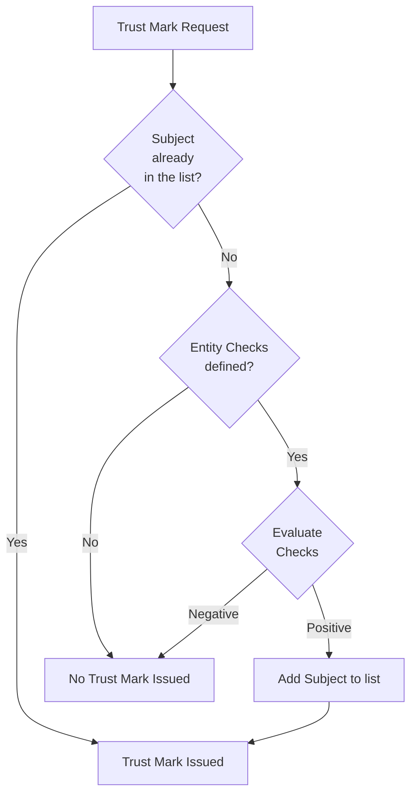

## Trust Mark Issuance
The issuance of Trust Marks boils down to "if you are on the list of entities
that can obtain this Trust Mark, we will issue the Trust Mark".
Therefore, our Trust Mark Issuer implementation manages for each Trust Mark a 
list of entities that can obtain this Trust Mark.

It is possible to use the [Entity Checks](entity_checks.md) mechanism to
dynamically add entities to that list. I.e. any `EntityChecker` can be used on
the Trust Mark endpoint, resulting in the following behavior of the Trust Mark Issuer:

