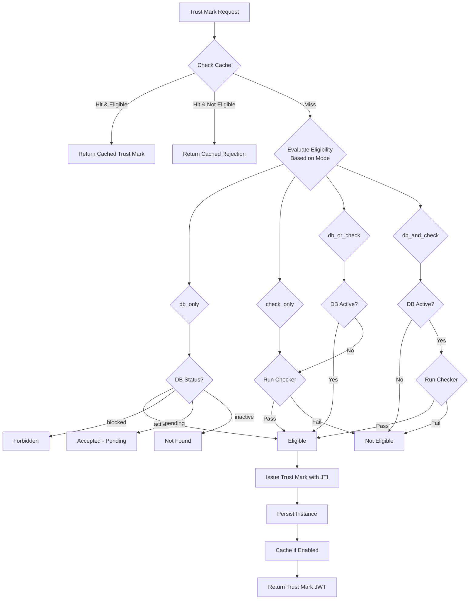

# Trust Marks

Trust Marks are signed JWTs that attest an entity's compliance with specific
criteria or membership in a trust scheme. Lighthouse provides a complete trust
mark ecosystem including issuance, status verification, listing, and
self-enrollment endpoints.

## Trust Mark Issuance

The Trust Mark endpoint issues trust marks to eligible entities. Eligibility is
determined through a flexible system combining database-managed subject lists
and configurable entity checkers.

### Subject Management

Each trust mark type maintains a list of subjects (entities) with one of four
statuses:

| Status | Description |
|--------|-------------|
| `active` | Entity can receive the trust mark |
| `blocked` | Entity is explicitly forbidden from obtaining the trust mark |
| `pending` | Entity has requested the trust mark and awaits approval |
| `inactive` | Entity is not in the list (default state) |

Subjects are managed via the Admin API under `/trust-marks/issuance-spec/:id/subjects`.

### Eligibility Modes

The `EligibilityConfig` on each `TrustMarkSpec` determines how eligibility is
evaluated. Five modes are supported:

| Mode | Behavior |
|------|----------|
| `db_only` | (Default) Only checks the subject's status in the database |
| `check_only` | Only runs the configured entity checker, ignores database |
| `db_or_check` | Checks database first; if not active, runs entity checker |
| `db_and_check` | Requires both active database status AND passing entity checker |
| `custom` | Uses only the configured entity checker (same as `check_only`) |

### Issuance Flow


```mermaid
graph TD
    A[Trust Mark Request] --> B{Check Cache};
    B --> |Hit & Eligible| C[Return Cached Trust Mark];
    B --> |Hit & Not Eligible| D[Return Cached Rejection];
    B --> |Miss| E{Evaluate Eligibility<br>Based on Mode};
    
    E --> F{db_only};
    E --> G{check_only};
    E --> H{db_or_check};
    E --> I{db_and_check};
    
    F --> J{DB Status?};
    J --> |active| K[Eligible];
    J --> |blocked| L[Forbidden];
    J --> |pending| M[Accepted - Pending];
    J --> |inactive| N[Not Found];
    
    G --> O{Run Checker};
    O --> |Pass| K;
    O --> |Fail| P[Not Eligible];
    
    H --> Q{DB Active?};
    Q --> |Yes| K;
    Q --> |No| O;
    
    I --> R{DB Active?};
    R --> |No| P;
    R --> |Yes| S{Run Checker};
    S --> |Pass| K;
    S --> |Fail| P;
    
    K --> T[Issue Trust Mark with JTI];
    T --> U[Persist Instance];
    U --> V[Cache if Enabled];
    V --> W[Return Trust Mark JWT];
```

### Additional Claims

Trust marks can include additional claims beyond the required fields:

- **Spec-level claims**: Defined on the `TrustMarkSpec`, applied to all subjects
  of that trust mark type
- **Subject-level claims**: Defined on individual `TrustMarkSubject` records,
  merged with (and override) spec-level claims

Common additional claims include `ref` (reference URL), `logo_uri`, and any
custom claims required by the trust scheme.

### Caching

Two levels of caching reduce load and improve performance:

| Cache | Configuration | Purpose |
|-------|---------------|---------|
| **Issued Trust Mark Cache** | `TrustMarkSpec.CacheTTL` (seconds) | Caches the signed JWT to avoid repeated signing |
| **Eligibility Cache** | `EligibilityConfig.CheckCacheTTL` (seconds) | Caches eligibility check results (useful for external checkers) |

Cache TTL is automatically capped by the trust mark's expiration time.

## Trust Mark Status Endpoint

The status endpoint allows verification of issued trust marks per the OIDC
Federation specification.

**Request:** `POST` with `application/x-www-form-urlencoded` body containing
the `trust_mark` parameter (the JWT to verify).

**Response:** Signed JWT with `application/trust-mark-status-response+jwt`
content type containing:

```json
{
  "iss": "https://issuer.example.com",
  "iat": 1234567890,
  "trust_mark": "<original JWT>",
  "status": "active"
}
```

### Status Values

| Status | Description |
|--------|-------------|
| `active` | Trust mark is valid and not revoked |
| `expired` | Trust mark has passed its expiration time |
| `revoked` | Trust mark was explicitly revoked |
| `invalid` | Signature verification failed or issuer mismatch |

### Instance Tracking

Each issued trust mark receives a unique `jti` (JWT ID) claim. Instances are
tracked in the database, enabling:

- Per-instance revocation
- Accurate status queries
- Audit trails of issued trust marks

## Trust Marked Entities Listing

The listing endpoint returns all entities holding valid (non-revoked,
non-expired) trust marks.

**Endpoint:** `GET` with query parameters

| Parameter | Required | Description |
|-----------|----------|-------------|
| `trust_mark_type` | Yes | The trust mark type identifier |
| `sub` | No | Check a specific entity (returns array with 0 or 1 element) |

**Response:** JSON array of entity IDs

```json
["https://entity1.example.com", "https://entity2.example.com"]
```

## Trust Mark Request Endpoint

Entities can self-enroll for trust marks using the request endpoint. This adds
them to the pending list for administrator approval.

**Endpoint:** `GET` with query parameters `trust_mark_type` and `sub`

| Current Status | Response |
|----------------|----------|
| `active` | `204 No Content` (already has trust mark) |
| `blocked` | `403 Forbidden` (cannot obtain this trust mark) |
| `pending` | `202 Accepted` (already pending) |
| `inactive` | `202 Accepted` (added to pending list) |

## Entity Checkers

Entity checkers evaluate whether an entity meets requirements for trust mark
issuance. They are configured via `EligibilityConfig.Checker` on each
`TrustMarkSpec`.

### Built-in Checkers

| Type | Description |
|------|-------------|
| `none` | Always passes (no checks performed) |
| `trust_mark` | Requires the entity to have a specific valid trust mark |
| `trust_path` | Requires a valid trust path to configured trust anchors |
| `authority_hints` | Requires a specific entity ID in the entity's `authority_hints` |
| `entity_id` | Requires the entity ID to be in a configured allowlist |
| `multiple_and` | Combines multiple checkers; all must pass |
| `multiple_or` | Combines multiple checkers; at least one must pass |
| `db_list` | Checks the `TrustMarkSubject` table for active status |
| `http_list` | Fetches a JSON array of entity IDs from an HTTP endpoint |
| `http_list_jwt` | Fetches a signed JWT containing entity IDs, with JWKS or trust anchor verification |

### Contextual Checkers

Some checkers (like `db_list`) require runtime context and implement the
`ContextualEntityChecker` interface. The trust mark endpoint automatically
provides the required context (storage backend, trust mark type).

### Custom Checkers

Register custom checkers using `RegisterEntityChecker`:

```go
lighthouse.RegisterEntityChecker("my_checker", func() lighthouse.EntityChecker {
    return &MyCustomChecker{}
})
```

Custom checkers must implement the `EntityChecker` interface:

```go
type EntityChecker interface {
    Check(entityConfiguration *oidfed.EntityStatement, entityTypes []string) (bool, int, *oidfed.Error)
    yaml.Unmarshaler
}
```

## Revocation

Trust marks can be revoked in several ways:

### Automatic Revocation

When a subject's status changes to `blocked` or `inactive`, or when a subject
is deleted, all issued trust mark instances for that subject are automatically
revoked.

### Manual Revocation

Individual instances can be revoked via the issued trust mark instance store:

```go
instanceStore.Revoke(jti)           // Revoke by JTI
instanceStore.RevokeBySubjectID(id) // Revoke all for a subject
```

### Expiration Cleanup

Expired trust mark instances can be cleaned up using:

```go
instanceStore.DeleteExpired(retentionDays)
```
